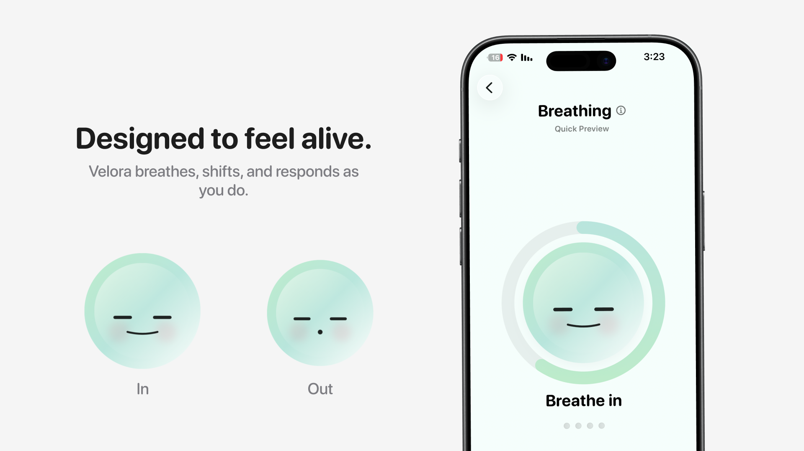
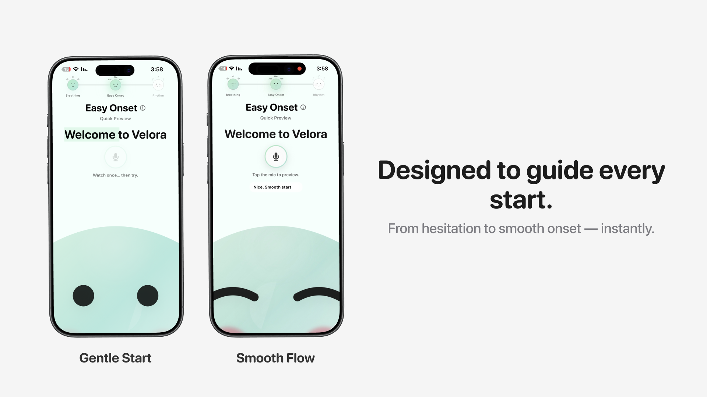
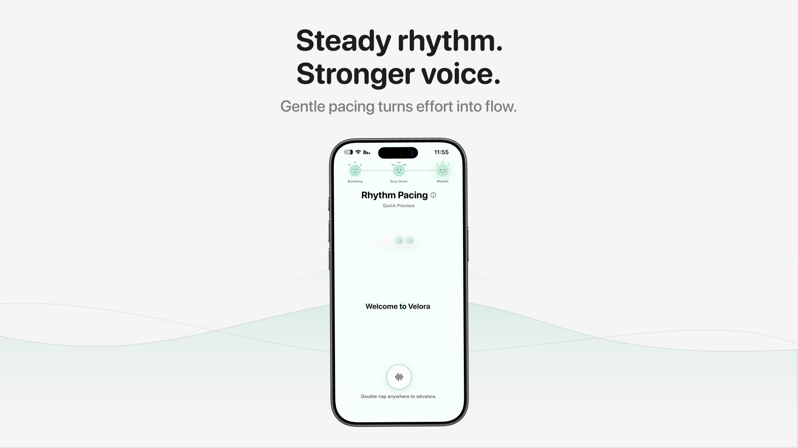

# Velora 🌿

**Velora** is an emotionally intelligent speech practice experience designed for people who stutter.

Instead of repeating random words or isolated sentences, Velora allows users to **rehearse real speaking moments** in a calm and supportive environment.

The project was created as a submission for the **Apple Swift Student Challenge 2026**.

---

# ✨ The Idea

Imagine wanting to speak — but wishing you could rehearse the moment first.

Not random sentences.  
Not mechanical speech drills.

But real situations:
- introducing yourself
- answering a question
- responding when someone is waiting

Velora was designed around a simple insight:

> People don't just want to practice speech.  
> They want to practice **moments that matter**.

Velora provides guided scenarios where users can regulate their breathing, begin speaking gently, find rhythm, and try again — all inside a space that feels calm, alive, and supportive.

---

# 🌱 What Makes Velora Different

Most speech training tools feel clinical or repetitive.

Velora focuses on **experience design**.

Users do not speak into silence.  
They interact with **Velora**, a responsive character that:

• breathes with the user  
• reacts to progress  
• follows words during speech  
• provides gentle emotional feedback  

This creates a practice environment that feels **alive rather than mechanical**.

---

# 🧭 Experience Flow

Velora follows a structured experience designed to gradually support fluency.

### 1️⃣ Onboarding
A calm introduction that establishes psychological safety.

### 2️⃣ Home Screen
A minimal interface with Velora present and a single primary action.

### 3️⃣ Topic Selection
Users choose between:

**Reading Passages**
Structured reading practice.

**Real-Life Scenarios**
Context-based speaking simulations.

### 4️⃣ Live Speech Session

The speaking experience unfolds across three phases:

**Breathing Ritual**

A short guided breathing experience that helps users regulate before speaking.
Velora visually expands and contracts with each breath.

**Easy Onset**

Users practice beginning speech gently to reduce tension.

**Rhythm Pacing**

Speech is paced through subtle visual rhythm cues.

### 5️⃣ Feedback Screen

Users receive gentle feedback including:

• Smoothness score  
• Rhythm score  
• Confidence indicator  
• One supportive suggestion  

---

# 🫧 Velora Character

Velora is the emotional center of the experience.

The character is built entirely with **SwiftUI** using gradients and animations.

Velora:

🌬 breathes with the user  
👀 follows spoken words  
😊 reacts with encouraging expressions  
✨ subtly changes behavior across phases

The goal is to make speech practice feel **supportive rather than stressful**.

---

# 🎤 Techniques Used

Velora integrates techniques commonly used in speech therapy.

### Breathing Regulation
A short breathing ritual helps reduce speaking tension.

### Easy Onset
Users practice starting speech with a softer onset.

### Rhythm Pacing
Speech pacing is supported by gentle visual rhythm.

These techniques are woven into the experience rather than presented as exercises.

---

# 🧠 Technology

Velora was built using modern Apple technologies.

**Frameworks**

• Swift  
• SwiftUI  
• Speech Framework  
• AVFoundation  

**Core Systems**

• on-device speech recognition  
• speech onset detection  
• rhythm pacing engine  
• guided karaoke-style highlighting  
• audio recording and playback  

All speech processing runs **fully offline**.

---

# ♿ Accessibility Considerations

Velora was designed to reduce pressure during speech practice.

Design choices include:

• minimal cognitive load  
• supportive feedback language  
• calm visual pacing  
• clear interaction flow  

The experience aims to create a **safe environment for speaking**.

---

# 🎨 Design System

Velora uses a soft visual language built around calm colors.

Palette:

Mint  
Aqua  
Ink  
Paper

The design avoids harsh contrast and focuses on clarity and emotional comfort.

---

# 📸 Screenshots

### 🌬 Breathing Ritual

A calm breathing entry ritual that helps the user regulate before speaking.  
Velora expands and contracts visually to guide each breath.

---

### 🎤 Easy Onset

Users practice starting speech gently.  
The current word highlights as the user speaks, encouraging a softer and more controlled onset.

---

### 🎵 Rhythm Pacing

Speech is paced using a subtle visual rhythm.  
This helps users maintain smoother timing and build speaking confidence.

---

# 🚀 Future Improvements

Possible future directions include:

• expanded speaking scenarios  
• adaptive difficulty levels  
• deeper speech analysis  
• long-term progress tracking  

---

# 👩‍💻 Author

**Layan Allhidaan**

Swift Student Challenge 2026 Submission
